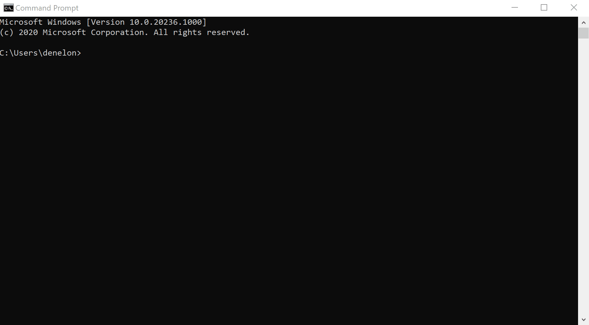

# Welcome to the Windows Package Manager Client (aka winget.exe) repository

This repository contains the source code for the Windows Package Manager Client (aka winget.exe).



The packages available to the client are in the [Community repo](https://github.com/microsoft/winget-pkgs).

> The Windows Package Manager project is in Preview. We welcome all feedback, and that feedback might lead to big (maybe even breaking) changes.

## Installing the client

> The client requires Windows 10 1709 (build 16299) or later at this time.

### Microsoft Store [Recommended]

The client is distributed within the [App Installer](https://www.microsoft.com/en-us/p/app-installer/9nblggh4nns1) package. While this package is pre-installed on Windows, the client will not be made generally available during the Preview period. In order to get automatic updates from the Microsoft Store that contain the client, one must do one of the following:

* Install a [Windows 10 Insider](https://insider.windows.com/) build
* Join the Preview flight ring by [signing up](http://aka.ms/winget-InsiderProgram)

Once you have received the updated App Installer you should be able to execute `winget`. Some users have reported [issues](https://github.com/microsoft/winget-cli/issues/210) with the client not being on their PATH.

### Manually Update

The same Microsoft Store package will be made available via our [Releases](https://github.com/microsoft/winget-cli/releases). Note that installing this package will give you the WinGet client, but it will not enable automatic updates from the Microsoft Store.

> You may need to install the [VC++ v14 Desktop Framework Package](https://docs.microsoft.com/en-us/troubleshoot/cpp/c-runtime-packages-desktop-bridge#how-to-install-and-update-desktop-framework-packages).
> This should only be necessary on older builds of Windows 10 and only if you get an error about missing framework packages.

### Build your own

You can also [build the client yourself](#building-the-client). While the client should be perfectly functional, we are not ready to provide full support for clients running outside of the official distribution mechanisms yet. Feel free to file an Issue, but know that it may get lower prioritization.

## Build Status

[](https://dev.azure.com/ms/winget-cli/_build/latest?definitionId=344&branchName=master)

## Windows Package Manager 1.0 Roadmap
The plan for delivering Windows Package Manager v1.0 [is described here](doc/windows-package-manager-v1-roadmap.md), and will be updated as the project proceeds.

## Overview of the  Windows Package Manager
The **Windows Package Manager** is a tool designed to help you quickly and easily discover and install those tools that make your PC environment special.  By using the **Windows Package Manager**, from one command, you can install your favorite tool: 
```winget install <tool>```

For Preview, the goal is to get something usable in your hands as soon as possible. At preview you can **search**, **show**, and **install** packages.  Soon we will have **uninstall**, **list** and **update**.  These items are available on our [backlog](https://github.com/microsoft/winget-cli/issues), so feel free to upvote the features you want.

## Overview  

### Client Repository
This winget-cli repository includes the source code designed to build the client.  You are encouraged to participate in the development of this client. We have plenty of backlog features in our [Issues](https://github.com/microsoft/winget-cli/issues). You can upvote the ones you want, add more, or even [get started on one.](https://github.com/microsoft/winget-cli/projects/1)

### Sources
The client is built around the concept of sources; a set of packages effectively. Sources provide the ability to discover and retrieve the metadata about the packages, so that the client can act on it.

The default source reflects that data available from the [Community repo](https://github.com/microsoft/winget-pkgs).

We plan to better support additional sources, and additional types of sources, in the future. For now, additional sources can be configured, but only one used at a time.

### Package Manager Service 
The **Package Manager Service** is responsible for approving Pull Requests.  It validates the YAML and [manifest spec](/doc/ManifestSpecv0.1.md) for spec compliance.


## Building the client

### Prerequisites

* Windows 10 1709 (16299) or later
* [Developer Mode enabled](https://docs.microsoft.com/en-us/windows/uwp/get-started/enable-your-device-for-development)
* [Visual Studio 2019](https://visualstudio.microsoft.com/downloads/)
   * Or use winget to install it ;) (although you may need to adjust the workloads via Tools->Get Tools and Features...)
* The following workloads:
   * .NET Desktop Development
   * Desktop Development with C++
   * Universal Windows Platform Development
* The following extensions:
   * [Microsoft Visual Studio Installer Projects](https://marketplace.visualstudio.com/items?itemName=VisualStudioClient.MicrosoftVisualStudio2017InstallerProjects)

### Building

We currently only build using the solution; command line methods of building a VS solution should work as well.

## Credit

We would like to thank Keivan Beigi @kayone for his work on AppGet which helped us on the initial project direction for Windows Package Manager.


## Contributing

This project welcomes contributions and suggestions.  Most contributions require you to agree to a
Contributor License Agreement (CLA) declaring that you have the right to, and actually do, grant us
the rights to use your contribution. For details, visit https://cla.opensource.microsoft.com.

When you submit a pull request, a CLA bot will automatically determine whether you need to provide
a CLA and decorate the PR appropriately (e.g., status check, comment). Simply follow the instructions
provided by the bot. You will only need to do this once across all repos using our CLA.

This project has adopted the [Microsoft Open Source Code of Conduct](https://opensource.microsoft.com/codeofconduct/).
For more information, please refer to the [Code of Conduct FAQ](https://opensource.microsoft.com/codeofconduct/faq/) or
contact [opencode@microsoft.com](mailto:opencode@microsoft.com) with any additional questions or comments.

## Data/Telemetry

The winget.exe client is instrumented to collect usage and diagnostic (error) data and sends it to Microsoft to help improve the product. 

If you build the client yourself the instrumentation will not be enabled and no data will be sent to Microsoft.

The winget.exe client respects machine wide privacy settings and users can opt-out on their device, as documented in the Microsoft Windows privacy statement [here](https://support.microsoft.com/en-us/help/4468236/diagnostics-feedback-and-privacy-in-windows-10-microsoft-privacy).

In short to opt-out, go to `Start`, then select `Settings` > `Privacy` > `Diagnostics & feedback`, and select `Basic`. 

See the [privacy statement](privacy.md) for more details.
